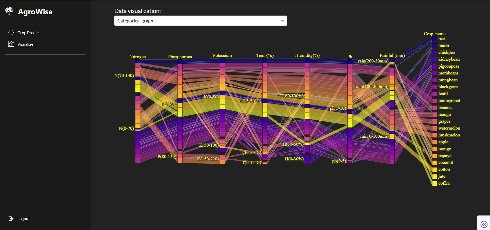

# 🌾 Precision Agriculture App 🌾

<div align="center">
  
  
</div>

[Watch the Demo Video](docs/app.mp4)

<p align="center">
  <a href="https://precision-agriculture.herokuapp.com/">🖥️ Live App</a> •
  <a href="#features">⚙️ Features</a> •
  <a href="#tech-stack">🛠 Tech Stack</a> •
  <a href="#how-it-works">🧠 How It Works</a> •
  <a href="#getting-started">🚀 Getting Started</a>
</p>

---

## 🌱 Motivation

Agriculture is evolving with the help of AI and data-driven technologies:

- Farms generate vast amounts of data daily—on temperature, soil quality, water usage, weather conditions, and more.
- This data, when analyzed with AI/ML models, enables **intelligent decision-making**, such as:
  - Predicting the best time to sow seeds.
  - Recommending optimal crop types.
  - Choosing hybrid seeds for higher yield.

**Precision Agriculture** leverages these insights to improve harvest accuracy and quality — empowering farmers with real-time, actionable intelligence.

---

## 🧩 Project Description

This project demonstrates an **end-to-end AI-powered agriculture web app**, developed using open-source agricultural data from Kaggle.

### Key Highlights

- ✅ Data collected, cleaned, and preprocessed for modeling.
- ✅ Trained a **K-Nearest Neighbors (KNN)** model for crop recommendation.
- ✅ Developed a **Dash-based dashboard** to visualize the data and interact with the model.
- ✅ Integrated the ML model to make predictions based on user input.
- ✅ Deployed the app on **Heroku** for public access.

Try the live demo:  
👉 [https://precision-agriculture.herokuapp.com/](https://precision-agriculture.herokuapp.com/)

---

## 🔍 Features

- 📊 **Visualize Training Data**  
  Both graphical and tabular views of the agricultural dataset used for model training.

- 🧠 **Predict Crop Type**  
  Based on user input (e.g., temperature, pH, rainfall), the trained ML model recommends the most suitable crop.

- 🌾 **Dynamic UI**  
  Displays crop images and prediction results interactively.

- 🌐 **Cloud Deployment**  
  Seamlessly deployed on Heroku for accessibility from any device.

---

## ⚙️ Tech Stack

| Tool / Framework     | Purpose                          |
|----------------------|----------------------------------|
| Python               | Core programming language        |
| Pandas, NumPy        | Data analysis and preprocessing  |
| scikit-learn         | ML model training (KNN)          |
| Plotly Dash          | Interactive web dashboard        |
| Heroku               | App deployment                   |

---

## 🧠 How It Works

1. **Input**: User enters soil and environmental parameters (N, P, K, temperature, humidity, pH, rainfall).
2. **Processing**: The backend KNN model processes the input and predicts the most suitable crop.
3. **Output**: The app displays the crop name along with a representative image.
4. **Visualization**: Interactive plots and tables present training data insights.

---

## 🚀 Getting Started

### Clone the Repository

```bash
git clone https://github.com/your-username/precision-agriculture.git
cd precision-agriculture
```

### Create an environment

```bash
python -m venv venv
```

### Install Dependencies

```bash
pip install -r requirements.txt
```

### Run the App Locally

```bash
python -m frontend --local
```

Then open http://127.0.0.1:8050 in your browser.

## 📎 Resources
- 📂 Dataset: Available on Kaggle

- 📘 Learn more about Dash: Dash by Plotly

- ☁️ Heroku: Heroku App Platform